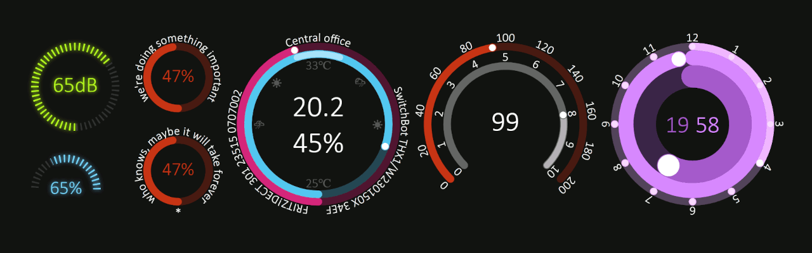

# Svelte Gauge

[](https://www.npmjs.com/package/svelte-gauge)
[](https://bundlephobia.com/package/svelte-gauge)
[](https://www.npmjs.com/package/svelte-gauge)
[](LICENSE)

A customizable and animated gauge component built with Svelte, perfect for visualizing progress, performance metrics, or other numerical data.



## 🎮 Demo

Experience the Svelte Gauge in action:
[Try it in the Svelte Playground](https://svelte.dev/playground/8e9390da303a4e33a5e53d431ed0df94?version=5.9.0)

## 📦 Installation

Install the package via npm:

```bash
npm install svelte-gauge
```

## 🛠 Usage

Import the component and use it in your Svelte application:

```Svelte
<script>
  import Gauge from "svelte-gauge";
</script>

<Gauge
  value={value}
  start={0}
  stop={100}
  stroke={20}
  titles={["One", "Two", "Three"]}
  ranges={[
    [0, 33],
    [34, 66],
    [67, 100],
  ]}
  width="300px"
  class="custom-gauge"
/>

```
